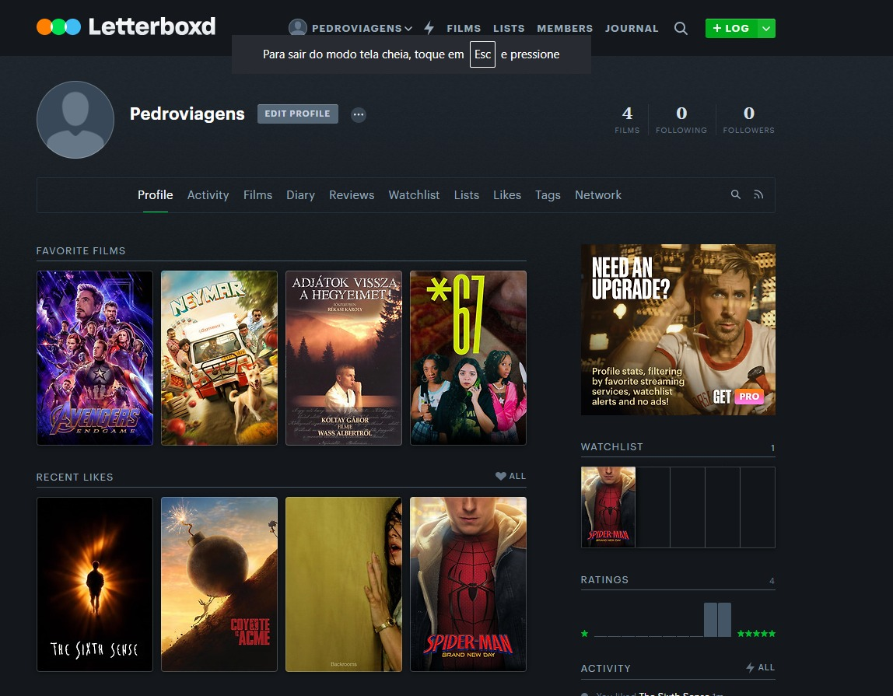
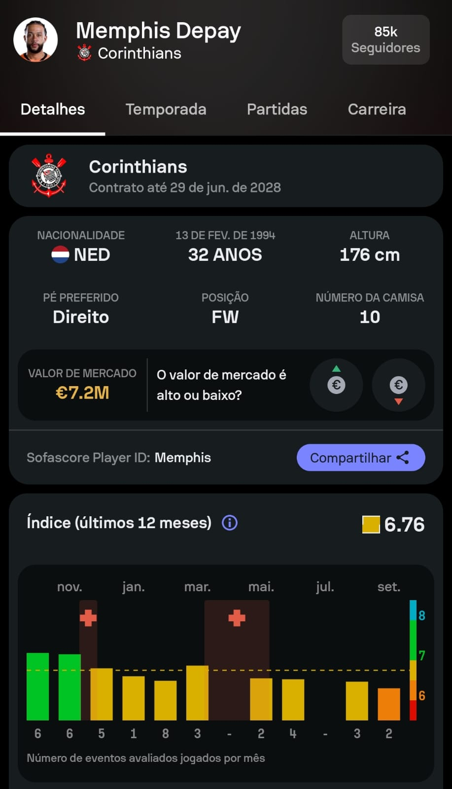
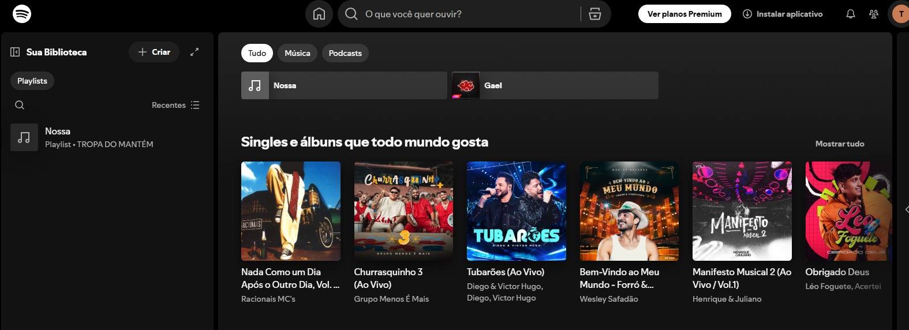

# References — CineDiário

## 1. Objetivo

As referências abaixo orientam as decisões de experiência e interface.

## 2. Referência 01 — Letterboxd

### Fonte
https://letterboxd.com

### Imagem

### O que observamos?
O perfil do usuário é organizado como uma grade de pôsteres, com a nota que a pessoa deu aparecendo em cima da capa. O perfil também tem uma seção fixa de filmes favoritos, separada do resto do histórico.

### O que vamos aproveitar?
A grade de pôsteres com a nota no card e a ideia de destacar os preferidos em uma seção própria dentro do perfil.

### Como será adaptado?
Usamos a grade na página Meu Diário e no Perfil, com o mesmo componente de card. A seção de favoritos funciona como no Letterboxd: o usuário escolhe até 5 títulos na mão, pelo botão na página de detalhe, e pode trocar quando quiser. A diferença é que só permitimos favoritar o que já foi marcado como assistido, porque o diário é o centro do nosso produto.

## 3. Referência 02 — SofaScore

### Fonte
https://www.sofascore.com

### Imagem

### O que observamos?
Nas telas de estatística de partida, o SofaScore mostra cada número (posse de bola, chutes, finalizações) em um card curto e isolado, com o valor grande em cima e o rótulo pequeno embaixo.

### O que vamos aproveitar?
O formato de card de estatística, com o número em destaque e o rótulo embaixo.

### Como será adaptado?
Viram os cards do Perfil: total assistido, filmes, séries e nota média. Trocamos as métricas de partida por métricas de consumo de filme e série. Mantivemos só quatro cards para não poluir a página.

## 4. Referência 03 — Spotify

### Fonte
https://open.spotify.com

### Imagem

### O que observamos?
O conteúdo é apresentado em fileiras e grades de cards, onde a capa é o elemento principal e o texto fica em segundo plano.

### O que vamos aproveitar?
A ideia de deixar a imagem carregar o reconhecimento do conteúdo, com o texto em tamanho menor abaixo dela.

### Como será adaptado?
Aplicamos nos resultados de busca da Home. O pôster ocupa quase todo o card e o título e o ano ficam abaixo, em fonte menor. Diferente do Spotify, não separamos por categoria, porque a Home é uma busca e não uma tela de descoberta com seções prontas.